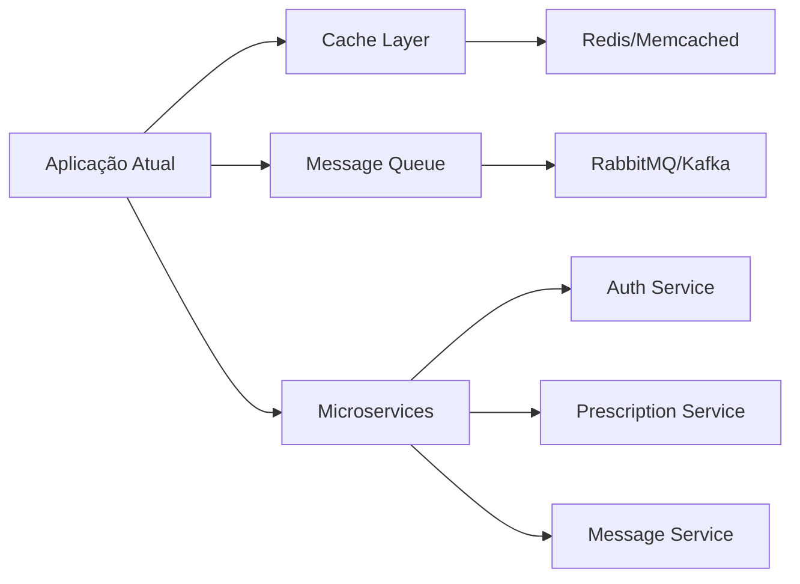

# 🏗️ Arquitetura do Nexus Med

> Documentação completa da arquitetura, padrões e estrutura do sistema

## 📋 Índice

- [Visão Geral](#visão-geral)
- [Arquitetura do Sistema](#arquitetura-do-sistema)
- [Stack Tecnológica](#stack-tecnológica)
- [Estrutura de Diretórios](#estrutura-de-diretórios)
- [Camadas da Aplicação](#camadas-da-aplicação)
- [Fluxo de Dados](#fluxo-de-dados)
- [Padrões e Princípios](#padrões-e-princípios)
- [Segurança](#segurança)
- [Escalabilidade](#escalabilidade)

---

## 🎯 Visão Geral

O **Nexus Med** é uma plataforma web mobile-first para integração entre médicos e pacientes, permitindo gerenciamento de consultas, receitas, exames, dados de saúde e comunicação em tempo real.

### Características Principais

- ✅ **Mobile-First**: Interface otimizada para dispositivos móveis
- 🔐 **Segurança**: Autenticação JWT com refresh tokens
- 📱 **PWA-Ready**: Preparado para funcionar como Progressive Web App
- ♿ **Acessibilidade**: Seguindo padrões WCAG 2.2 (AA)
- 🇧🇷 **LGPD**: Conformidade com a Lei Geral de Proteção de Dados
- 🎨 **Design System**: Sistema de design consistente e escalável

---

## 🏛️ Arquitetura do Sistema

### Visão de Alto Nível

```
┌─────────────────────────────────────────────────────────────┐
│                      CLIENTE (Browser)                       │
│  ┌──────────────────────────────────────────────────────┐  │
│  │            React 18 + TypeScript + Vite              │  │
│  │  ┌──────────┐  ┌───────────┐  ┌──────────────────┐ │  │
│  │  │  Pages   │  │ Components│  │  Core (Context)  │ │  │
│  │  └──────────┘  └───────────┘  └──────────────────┘ │  │
│  └──────────────────────────────────────────────────────┘  │
└───────────────────────┬─────────────────────────────────────┘
                        │ HTTPS / REST API
                        │
┌───────────────────────▼─────────────────────────────────────┐
│                    API Gateway / Backend                     │
│  ┌──────────────────────────────────────────────────────┐  │
│  │              .NET 10 WebApi (ASP.NET)                │  │
│  │  ┌─────────────┐  ┌─────────────┐  ┌─────────────┐ │  │
│  │  │ Controllers │  │ Application │  │ Domain      │ │  │
│  │  │    Layer    │  │   Layer     │  │   Layer     │ │  │
│  │  └─────────────┘  └─────────────┘  └─────────────┘ │  │
│  │         │                │                 │         │  │
│  │         └────────────────┴─────────────────┘         │  │
│  │                         │                            │  │
│  │              ┌──────────▼──────────┐                 │  │
│  │              │  Infrastructure     │                 │  │
│  │              │      Layer          │                 │  │
│  │              └─────────────────────┘                 │  │
│  └──────────────────────────────────────────────────────┘  │
└───────────────────────┬─────────────────────────────────────┘
                        │ EF Core / ADO.NET
                        │
┌───────────────────────▼─────────────────────────────────────┐
│                    BANCO DE DADOS                            │
│  ┌──────────────┐  ┌──────────────┐  ┌──────────────┐     │
│  │ SQL Server   │  │   SQLite     │  │  PostgreSQL  │     │
│  │  (Produção)  │  │    (Dev)     │  │  (Opcional)  │     │
│  └──────────────┘  └──────────────┘  └──────────────┘     │
└─────────────────────────────────────────────────────────────┘
```

### Padrão Arquitetural: Clean Architecture

O backend segue os princípios da **Clean Architecture**, garantindo:

- 🎯 **Separação de Responsabilidades**: Cada camada tem uma função específica
- 🔄 **Inversão de Dependências**: Dependências apontam para o centro (Domain)
- 🧪 **Testabilidade**: Fácil isolamento e testes unitários
- 🔌 **Flexibilidade**: Troca de frameworks e bancos de dados sem impacto no domínio

---

## 🛠️ Stack Tecnológica

### Frontend

| Tecnologia | Versão | Propósito |
|-----------|--------|-----------|
| **React** | 18.x | Framework UI com composição de componentes |
| **TypeScript** | 5.x | Type safety e melhor DX |
| **Vite** | Latest | Build tool moderna e rápida |
| **React Router** | 6.x | Roteamento SPA |
| **CSS Variables** | Nativo | Tokens de design e temas |

### Backend

| Tecnologia | Versão | Propósito |
|-----------|--------|-----------|
| **.NET** | 10.0 | Runtime e framework principal |
| **ASP.NET Core** | 10.0 | Web API framework |
| **Entity Framework Core** | Latest | ORM para acesso a dados |
| **BCrypt.Net** | Latest | Hash seguro de senhas |
| **JWT Bearer** | Latest | Autenticação baseada em tokens |

### Banco de Dados

| Opção | Ambiente | Características |
|-------|----------|----------------|
| **SQL Server** | Produção/Docker | Robusto, suporta grandes volumes |
| **SQLite** | Desenvolvimento | Leve, zero configuração |
| **PostgreSQL** | Opcional | Open source, alta performance |

### DevOps & Ferramentas

- **Docker**: Containerização do banco de dados
- **Git**: Controle de versão
- **npm**: Gerenciamento de pacotes frontend
- **NuGet**: Gerenciamento de pacotes backend

---

## 📁 Estrutura de Diretórios

### Frontend

```
frontend/
├── src/
│   ├── app/                    # Módulos Angular (legado)
│   ├── components/             # Componentes compartilhados React
│   │   └── ProtectedRoute.tsx  # HOC para rotas autenticadas
│   ├── core/                   # Serviços e contextos centrais
│   │   ├── api.ts              # Cliente HTTP base
│   │   └── AuthContext.tsx     # Context de autenticação
│   ├── pages/                  # Páginas/Views da aplicação
│   │   ├── LoginPage.tsx
│   │   ├── RegisterPage.tsx
│   │   ├── DashboardPage.tsx
│   │   ├── PrescriptionsPage.tsx
│   │   ├── ExamsPage.tsx
│   │   ├── HealthMetricsPage.tsx
│   │   ├── MessagesPage.tsx
│   │   ├── ConversationDetailPage.tsx
│   │   ├── ProfessionalsPage.tsx
│   │   └── LgpdPage.tsx
│   ├── App.tsx                 # Componente raiz com rotas
│   ├── main.tsx                # Entry point React
│   ├── index.css               # Estilos globais e design tokens
│   └── vite-env.d.ts           # Type definitions
├── index.html
├── package.json
├── tsconfig.json
└── vite.config.ts
```

### Backend

```
src/
├── NexusMed.Domain/            # Camada de Domínio
│   ├── Entities/               # Entidades do negócio
│   │   ├── User.cs
│   │   ├── Prescription.cs
│   │   ├── Exam.cs
│   │   ├── HealthMetric.cs
│   │   ├── Message.cs
│   │   ├── Conversation.cs
│   │   ├── Review.cs
│   │   └── LgpdConsent.cs
│   ├── Interfaces/             # Contratos de repositórios
│   │   └── IRepository.cs
│   └── NexusMed.Domain.csproj
│
├── NexusMed.Application/       # Camada de Aplicação
│   ├── DTOs/                   # Data Transfer Objects
│   │   ├── Auth/
│   │   ├── Prescriptions/
│   │   ├── Exams/
│   │   ├── HealthMetrics/
│   │   └── Messages/
│   ├── Services/               # Casos de uso
│   └── NexusMed.Application.csproj
│
├── NexusMed.Infrastructure/    # Camada de Infraestrutura
│   ├── Data/                   # Contexto EF Core
│   │   └── AppDbContext.cs
│   ├── Repositories/           # Implementações de repositórios
│   ├── Auth/                   # JWT, BCrypt
│   └── NexusMed.Infrastructure.csproj
│
└── NexusMed.WebApi/            # Camada de Apresentação
    ├── Controllers/            # Endpoints REST
    │   ├── AuthController.cs
    │   ├── PrescriptionsController.cs
    │   ├── ExamsController.cs
    │   ├── HealthMetricsController.cs
    │   ├── MessagesController.cs
    │   ├── ProfessionalsController.cs
    │   └── LgpdController.cs
    ├── Middleware/             # Middlewares customizados
    ├── Program.cs              # Configuração da aplicação
    ├── appsettings.json        # Configurações
    └── NexusMed.WebApi.csproj
```

---

## 🔄 Camadas da Aplicação

### 1️⃣ Domain Layer (Núcleo)

**Responsabilidade**: Define as entidades de negócio e regras de domínio.

```csharp
// Exemplo: User Entity
public class User
{
    public int Id { get; set; }
    public string Email { get; set; }
    public string PasswordHash { get; set; }
    public UserRole Role { get; set; } // Patient | Professional
    public string Name { get; set; }
    public DateTime CreatedAt { get; set; }
}
```

**Características**:
- ✅ Sem dependências externas
- ✅ Regras de negócio puras
- ✅ Entidades anêmicas ou ricas (DDD)

### 2️⃣ Application Layer (Casos de Uso)

**Responsabilidade**: Orquestra a lógica de negócio e coordena o fluxo de dados.

```csharp
// Exemplo: Service de autenticação
public interface IAuthService
{
    Task<LoginResponseDto> LoginAsync(LoginRequestDto request);
    Task<RegisterResponseDto> RegisterAsync(RegisterRequestDto request);
    Task<TokenResponseDto> RefreshTokenAsync(string refreshToken);
}
```

**Características**:
- ✅ DTOs para entrada/saída
- ✅ Validações de negócio
- ✅ Não conhece detalhes de infraestrutura

### 3️⃣ Infrastructure Layer (Implementações)

**Responsabilidade**: Implementa as interfaces definidas no domínio.

```csharp
// Exemplo: Repository implementação
public class UserRepository : IUserRepository
{
    private readonly AppDbContext _context;
    
    public async Task<User> GetByEmailAsync(string email)
    {
        return await _context.Users
            .FirstOrDefaultAsync(u => u.Email == email);
    }
}
```

**Características**:
- ✅ Acesso a banco de dados (EF Core)
- ✅ Serviços externos (Email, Storage)
- ✅ Segurança (JWT, BCrypt)

### 4️⃣ WebApi Layer (Apresentação)

**Responsabilidade**: Expõe endpoints HTTP e gerencia requisições/respostas.

```csharp
[ApiController]
[Route("api/[controller]")]
public class AuthController : ControllerBase
{
    private readonly IAuthService _authService;
    
    [HttpPost("login")]
    public async Task<IActionResult> Login([FromBody] LoginRequestDto dto)
    {
        var response = await _authService.LoginAsync(dto);
        return Ok(response);
    }
}
```

**Características**:
- ✅ Controllers RESTful
- ✅ Autenticação JWT
- ✅ Validação de entrada
- ✅ Tratamento de erros

---

## 📊 Fluxo de Dados

### Autenticação (Login)

```
┌──────────┐      POST /api/auth/login       ┌──────────────┐
│          │──────────────────────────────────>│              │
│  Client  │    { email, password }            │ Controller   │
│          │                                   │              │
└──────────┘                                   └──────┬───────┘
     ▲                                                │
     │                                                ▼
     │                                         ┌──────────────┐
     │                                         │              │
     │                                         │   Service    │
     │                                         │              │
     │                                         └──────┬───────┘
     │                                                │
     │                                                ▼
     │                                         ┌──────────────┐
     │                                         │              │
     │                                         │  Repository  │
     │                                         │              │
     │                                         └──────┬───────┘
     │                                                │
     │                                                ▼
     │                                         ┌──────────────┐
     │   { accessToken, refreshToken }         │              │
     │<────────────────────────────────────────│   Database   │
     │                                         │              │
     └─────────────────────────────────────────┴──────────────┘
```

### Requisição Autenticada

```
┌──────────┐    GET /api/prescriptions         ┌──────────────┐
│          │──────────────────────────────────>│              │
│  Client  │  Authorization: Bearer <token>    │   Middleware │
│          │                                   │  (JWT Auth)  │
└──────────┘                                   └──────┬───────┘
     ▲                                                │
     │                                                ▼
     │                                         ┌──────────────┐
     │                                         │              │
     │                                         │  Controller  │
     │                                         │ [Authorize]  │
     │                                         └──────┬───────┘
     │                                                │
     │                                                ▼
     │                                         ┌──────────────┐
     │                                         │              │
     │                                         │   Service    │
     │                                         │  (Business)  │
     │                                         └──────┬───────┘
     │                                                │
     │                                                ▼
     │   [ { id, medication, ... } ]           ┌──────────────┐
     │<────────────────────────────────────────│  Repository  │
     └─────────────────────────────────────────┴──────────────┘
```

---

## 🎯 Padrões e Princípios

### SOLID

1. **S**ingle Responsibility Principle
   - Cada classe/componente tem uma única responsabilidade
   - Exemplo: `AuthService` apenas gerencia autenticação

2. **O**pen/Closed Principle
   - Aberto para extensão, fechado para modificação
   - Interfaces permitem novas implementações sem alterar código existente

3. **L**iskov Substitution Principle
   - Implementações podem ser substituídas sem quebrar o sistema
   - Exemplo: Trocar `SqlServerRepository` por `PostgresRepository`

4. **I**nterface Segregation Principle
   - Interfaces específicas em vez de genéricas
   - Exemplo: `IUserRepository`, `IPrescriptionRepository`

5. **D**ependency Inversion Principle
   - Depender de abstrações, não implementações
   - Injeção de dependências via DI Container

### DRY (Don't Repeat Yourself)

- Componentes reutilizáveis no frontend (`.btn`, `.card`, `.input`)
- Serviços compartilhados no backend
- Design tokens para consistência visual

### KISS (Keep It Simple, Stupid)

- Código limpo e legível
- Evitar over-engineering
- Priorizar simplicidade sobre complexidade prematura

---

## 🔐 Segurança

### Autenticação & Autorização

```
┌─────────────────────────────────────────────────────────────┐
│                    Fluxo de Segurança                        │
├─────────────────────────────────────────────────────────────┤
│                                                              │
│  1. Login: email + senha                                     │
│     └─> Senha é hasheada com BCrypt                         │
│     └─> Comparação segura com hash armazenado               │
│                                                              │
│  2. Geração de Tokens:                                       │
│     ├─> Access Token (JWT, 15 min)                          │
│     │   • userId                                             │
│     │   • email                                              │
│     │   • role (Patient/Professional)                        │
│     │                                                        │
│     └─> Refresh Token (30 dias)                             │
│         • Token único armazenado no banco                    │
│         • Permite renovação do access token                  │
│                                                              │
│  3. Requisições Autenticadas:                                │
│     └─> Header: Authorization: Bearer <accessToken>         │
│     └─> Middleware valida token e extrai userId             │
│                                                              │
│  4. Autorização por Role:                                    │
│     └─> [Authorize] em controllers                          │
│     └─> Verificação de role específica quando necessário    │
│                                                              │
└─────────────────────────────────────────────────────────────┘
```

### Boas Práticas Implementadas

| Prática | Implementação |
|---------|---------------|
| **Password Hashing** | BCrypt com salt automático |
| **Token-Based Auth** | JWT com expiração curta |
| **Refresh Tokens** | Tokens de longa duração para renovação |
| **HTTPS** | Obrigatório em produção |
| **CORS** | Configurado para domínios específicos |
| **SQL Injection** | Queries parametrizadas via EF Core |
| **XSS Protection** | Sanitização de inputs no frontend |

---

## 📈 Escalabilidade

### Estratégias de Escalabilidade

#### 1. **Escalabilidade Horizontal (Frontend)**

```
┌─────────────┐     ┌─────────────┐     ┌─────────────┐
│   Client    │     │   Client    │     │   Client    │
│  (Browser)  │     │  (Browser)  │     │  (Browser)  │
└──────┬──────┘     └──────┬──────┘     └──────┬──────┘
       │                   │                   │
       └───────────────────┴───────────────────┘
                           │
                    ┌──────▼──────┐
                    │  CDN / Load  │
                    │   Balancer   │
                    └──────┬──────┘
                           │
       ┌───────────────────┼───────────────────┐
       │                   │                   │
┌──────▼──────┐     ┌──────▼──────┐     ┌──────▼──────┐
│  API Server │     │  API Server │     │  API Server │
│   Instance  │     │   Instance  │     │   Instance  │
└─────────────┘     └─────────────┘     └─────────────┘
```

#### 2. **Otimizações Implementadas**

| Área | Otimização | Benefício |
|------|-----------|-----------|
| **Frontend** | Code splitting (Vite) | Carregamento mais rápido |
| **Frontend** | Lazy loading de rotas | Menor bundle inicial |
| **Frontend** | CSS Modules/Variables | Menor tamanho CSS |
| **Backend** | Async/Await | Maior throughput |
| **Backend** | Connection pooling | Reuso de conexões DB |
| **Backend** | DTO mapeamento | Menor transferência de dados |
| **Banco** | Índices em colunas chave | Queries mais rápidas |

#### 3. **Próximos Passos para Escala**



**Roadmap**:
1. **Cache**: Redis para sessões e dados frequentes
2. **Message Queue**: Processamento assíncrono de tarefas pesadas
3. **Microservices**: Separação de domínios em serviços independentes
4. **Event Sourcing**: Auditoria completa de mudanças
5. **CQRS**: Separação de leitura e escrita

---

## 🚀 Performance

### Métricas Alvo

| Métrica | Valor Alvo | Status |
|---------|------------|--------|
| **TTFB** (Time to First Byte) | < 200ms | ✅ |
| **FCP** (First Contentful Paint) | < 1.5s | ✅ |
| **LCP** (Largest Contentful Paint) | < 2.5s | ✅ |
| **TTI** (Time to Interactive) | < 3.5s | ✅ |
| **API Response Time** | < 100ms (média) | ✅ |

### Otimizações Frontend

- ✅ Vite para build otimizado
- ✅ Tree-shaking automático
- ✅ Minificação de CSS/JS
- ✅ Imagens otimizadas (WebP quando possível)
- ✅ Font subsetting

### Otimizações Backend

- ✅ EF Core com queries otimizadas
- ✅ Eager loading para evitar N+1
- ✅ Async/Await para I/O
- ✅ Response compression (Gzip/Brotli)

---

## 🧪 Testes

### Estratégia de Testes

```
┌─────────────────────────────────────────────────────────────┐
│                      Pirâmide de Testes                      │
├─────────────────────────────────────────────────────────────┤
│                                                              │
│                        ┌────────┐                            │
│                        │  E2E   │  ← Poucos, críticos        │
│                        └────────┘                            │
│                    ┌──────────────┐                          │
│                    │  Integration │  ← Moderados             │
│                    └──────────────┘                          │
│                ┌──────────────────────┐                      │
│                │    Unit Tests        │  ← Muitos, rápidos   │
│                └──────────────────────┘                      │
│                                                              │
└─────────────────────────────────────────────────────────────┘
```

### Ferramentas

| Camada | Ferramenta | Uso |
|--------|-----------|-----|
| **Frontend Unit** | Vitest / Jest | Componentes isolados |
| **Frontend E2E** | Playwright / Cypress | Fluxos completos |
| **Backend Unit** | xUnit | Lógica de negócio |
| **Backend Integration** | WebApplicationFactory | APIs completas |

---

## 📚 Referências

- [Clean Architecture - Robert C. Martin](https://blog.cleancoder.com/)
- [ASP.NET Core Documentation](https://docs.microsoft.com/aspnet/core)
- [React Documentation](https://react.dev/)
- [SOLID Principles](https://en.wikipedia.org/wiki/SOLID)
- [JWT Best Practices](https://tools.ietf.org/html/rfc8725)

---

## 🤝 Contribuindo

Para contribuir com o projeto:

1. Siga os padrões arquiteturais definidos
2. Mantenha a separação de camadas
3. Escreva testes para novas funcionalidades
4. Documente mudanças significativas
5. Siga o guia de estilo do código

---

**Última atualização**: Fevereiro 2026  
**Versão**: 1.0.0  
**Mantido por**: Equipe Nexus Med
